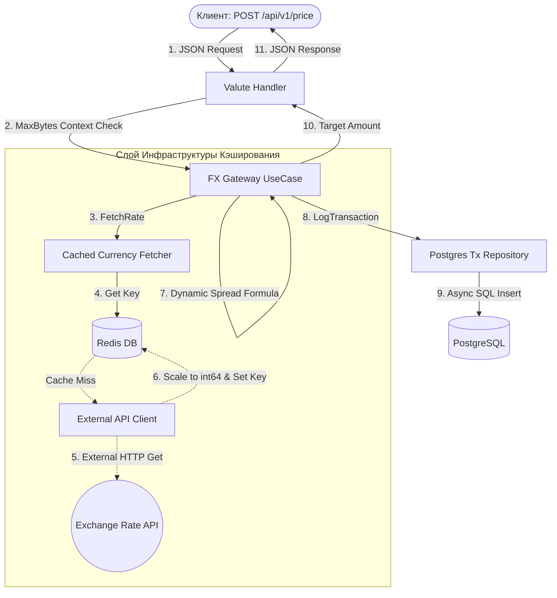

# FX Banking Gateway (High-Precision FinTech Middleware) 

Высокопроизводительный асинхронный валютный шлюз (middleware) на Go, разработанный по принципам **Clean Architecture**. Сервер обеспечивает отказоустойчивое получение спот-курсов валют от внешних провайдеров, рассчитывает динамические волатильные спреды и проводит сверхточные расчеты конвертации (Billing Log) для корпоративных клиентов.

## Ключевые архитектурные решения (Middle+ FinTech Scope)

Проект демонстрирует глубокое понимание специфики FinTech-систем и паттернов оптимизации ввода-вывода:

1. **Исключение погрешностей округления (Fixed-Point Arithmetic)**:
   * Использование типа данных `float64` в финансовых операциях запрещено из-за специфики стандарта IEEE 754. 
   * В приложении реализовано масштабирование всех денежных сумм и котировок (умножение на `10000` — базисные пункты `bps`). Все расчеты внутри Use Case происходят в целых числах (`int64`), исключая копейки потерь на округлении.
2. **Паттерн Декоратор: Cached Currency Fetcher**:
   * Для защиты лимитов внешнего API провайдера и снижения сетевых задержек (`latency`) слой инфраструктуры обернут в декоратор.
   * Система сначала проверяет актуальность курса в **Redis Cache** (`TTL = 1 час`). В случае промаха (`cache miss`) прозрачно опрашивается внешний HTTP-клиент, результат кэшируется в Redis и отдается вызывающей стороне.
3. **Квантовый расчет волатильности (Risk Management)**:
   * Величина маржи (спреда) не захардкожена, а рассчитывается динамически для каждой валютной пары. 
   * Бизнес-логика учитывает матрицу исторической волатильности валюты (`Volatility Matrix`), рассчитывая формулу: `totalSpreadBps = (volatility * 1217) / 10000 + 50`. Это защищает банк от убытков при резких скачках рынка (например, на парах с высокой волатильностью вроде TRY).
4. **Отказоустойчивое управление пулом соединений СУБД (PostgreSQL)**:
   * Конфигурация драйвера `pgx` защищает БД от падения под нагрузкой. Жестко лимитированы максимальные открытые и простаивающие коннекты (`MaxOpenConns: 25`, `MaxIdleConns: 25`), а также время их жизни. Перед стартом роутера выполняется обязательный `PingContext` с коротким таймаутом.
5. **Фоновый Воркер и Кэш-Вармап (Warmup)**:
   * Реализован автономный `CurrencyWorker`, управляемый горутиной и `time.Ticker`.
   * При старте приложения воркер выполняет мгновенный асинхронный "прогрев" кэша котировок основных валютных пар (`USD`, `EUR`, `JPY`), а затем каждый час обновляет их в фоне, разгружая пользовательские API-запросы.

---

## Архитектурная структура (Clean Architecture)

Зависимости направлены строго внутрь приложения (Dependency Inversion). Слой бизнес-логики (`usecase`) оперирует чистыми интерфейсами домена (`CurrencyFetcher`) и ничего не знает о деталях реализации Redis, HTTP или PostgreSQL.

├── cmd/app/                  # Точка входа, DI-контейнер, логирование, Graceful Shutdown  
├──  internal/
│    ├── domain/               # Чистые сущности (Quote), каноничные ошибки и интерфейсы 
│    ├── usecase/              # Конвертация, биллинг-логика, расчет спредов 
│    └── infrastructure/       # Драйверы БД, Redis-декоратор, HTTP-клиент, хэндлеры

### Схема обработки транзакции (Data Flow)



---

## Безопасность и Отказоустойчивость

* **Защита от OOM (Memory Flooding)**: На уровне HTTP-хэндлера входящий поток данных жестко ограничен с помощью `http.MaxBytesReader(w, r.Body, 1048576)` (максимум 1 МБ). Это защищает сервер от атак, направленных на переполнение оперативной памяти гигантскими JSON-пакетами.
* **Graceful Shutdown (Безопасная остановка)**: При перехвате системных сигналов (`SIGINT`, `SIGTERM`) приложение корректно завершает транзакции. Веб-серверу выделяется окно в 5 секунд на доработку текущих запросов (`context.WithTimeout`), после чего закрываются пулы БД и Redis, и завершает работу фоновый воркер (`sync.WaitGroup`).
* **Структурированное логирование**: Применен нативный пакет `log/slog` с выводом в формате JSON (`NewJSONHandler`). Логи содержат трейсы ошибок и исходный код вызова (`AddSource: true`).

---

## Стек технологий

* **Backend**: Go (Конкурентность, каналы, контексты `context.Context`, `sync.WaitGroup`).
* **Database**: PostgreSQL (драйвер `pgx/v5` со стандартным интерфейсом `database/sql`).
* **Caching**: Redis (клиент `go-redis/v7`).
* **Config**: `github.com/ilyakaznacheev/cleanenv` (чтение `.env` файлов).

---

## 🧪 Тестирование

Бизнес-логика Use Case покрыта надежными табличными тестами (`Table-driven tests`) без использования тяжелых мок-библиотек — изоляция достигнута за счет легковесных интерфейсных стабов (`stubFetcher`, `stubLogger`). Тесты верифицируют корректность математических округлений и обработку инфраструктурных сбоев (таймаут API, падение базы данных).

Запуск тестов:
```
go test -v ./internal/usecase/...
```

